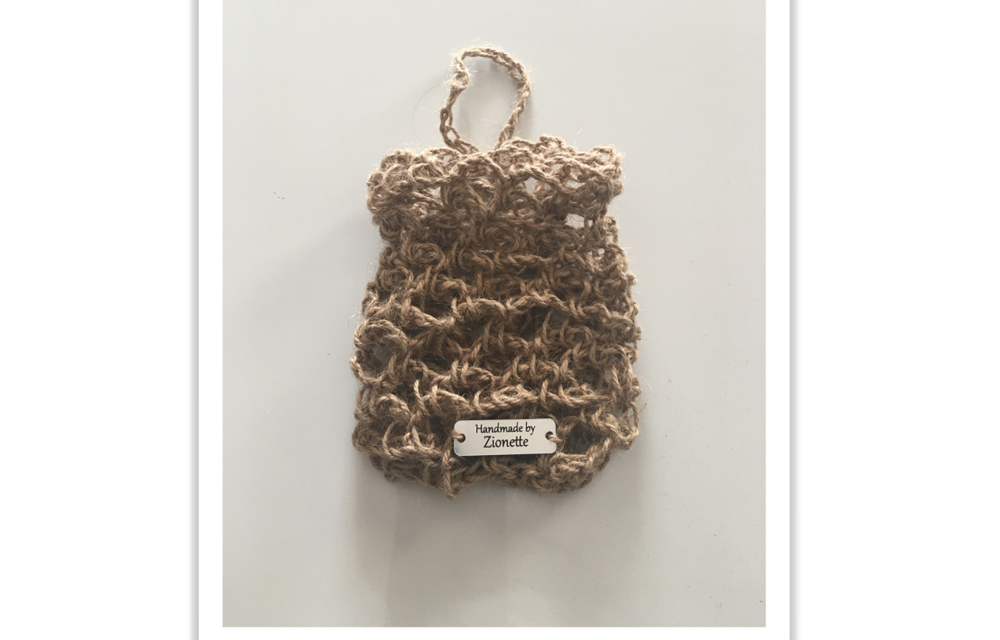

class: title, smokescreen, shelf, no-footer
background-image: url(leo-serrat-533922-unsplash.jpg)

# Zionette's Story...

###### "arrow -> -> side to see slides"
---
class: img-caption

Handmade Pieces of Art... 
---
class: img-caption

Shoe making by Handmade-by-Zionette.com
---
class: img-caption

Side view of shoe.
---
class: img-caption

Tweed Summer Hat Handmade-by-Zionette.com
---
class: img-caption

Hanging Soap Saver Handmade-by-Zionette.com
---
class: img-caption

Aloe~Cactus Flower boutique soap made with essential oils Handmade-by-Zionette.com
---
class: img-caption

Rose~Mint boutique soap made with essential oils Handmade-by-Zionette.com.
---
class: img-caption

Rosemary~Lavendar bud boutique soap made with essential oils Handmade-by-Zionette.comt.
---
class: img-caption

Rosemary~Lavendar flower boutique soap made with essential oils Handmade-by-Zionette.com.
---
class: title, smokescreen, shelf, no-footer
background-image: url(leo-serrat-533922-unsplash.jpg)

# Vertical Garden Growing...
---
class: img-caption

Cabbage~Cauliflour~Zucchini~Pickle Cucumbers~Tomatoes~Long Green Beans
---
class: img-caption

---
class: img-caption

---
class: img-caption

---
class: img-caption

---
class: img-caption

---
class: img-caption

---
class: img-caption

---
class: img-caption

---
class: img-caption

---
class: img-caption

---
class: img-caption

---
class: img-caption

---
class: img-caption

